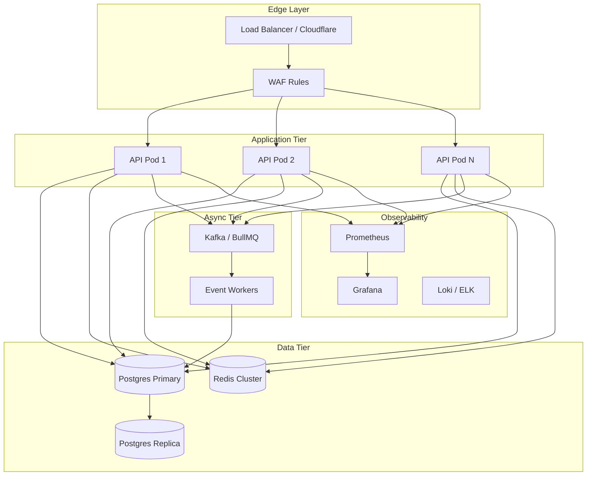

# SecureEdge — Production-Grade Architecture Review & Elevation Plan

## Section 1: What's Already Good ✅

| Area | Assessment |
|---|---|
| **Policy Engine** | Well-designed WHO×WHAT×CONDITIONS evaluator with priority ordering, per-policy simulation, and fail-safe defaults. Solid. |
| **Type System** | Comprehensive TypeScript types on both backend and frontend with proper enum modeling via Postgres custom types. |
| **CSRF Protection** | Double-submit cookie pattern correctly implemented with header validation on state-changing routes. |
| **Zod Validation** | Every request body validated server-side. Audit log query has proper pagination schema. |
| **Error Handling** | `asyncHandler` + centralized `errorHandler` with ZodError/HttpError discrimination. Clean pattern. |
| **Database Schema** | Well-normalized with proper FK constraints, cascading deletes, UUID PKs, and strategic indexes. |
| **Migration System** | Transactional migrations with `schema_migrations` tracking table. Production-safe. |
| **Seed Script** | Realistic test data with diverse personas, policies, devices, and access events. Excellent for demos. |
| **Frontend Architecture** | Clean separation: design-system tokens, typed API client, auth context, SSE hook, role-based layouts. |
| **SSE Real-time Feed** | Working pub/sub with keepalive, cleanup on disconnect, and synthetic event generation for demos. |
| **RBAC Middleware** | Clean composable `requireRole(...roles)` pattern with proper 401/403 differentiation. |
| **Audit Log** | Paginated, filterable query with search across user/app/reason fields. Already has `total` count for pagination. |

**Minor improvements for good areas** (no redesign needed):
- Add `RETURNING` clause consistency — some routes return `*`, others return specific columns
- Add `updated_at` column to `applications` and `groups` tables
- Helmet CSP `connectSrc` should include the API origin for SSE to work cross-origin in production

---

## Section 2: Identified Gaps — Priority List 🚨

### P0 — Critical (Security / Data Integrity)

| # | Gap | Impact |
|---|---|---|
| 1 | **No Redis usage** — Redis is in docker-compose but never used. Rate limiting is in-memory only, resets on restart, doesn't work across instances. | Rate limiting bypassed in multi-instance deploy |
| 2 | **Hardcoded MFA code `123456`** — No real TOTP/WebAuthn implementation. MFA state stored in a non-httpOnly cookie (`se_mfa=1`) that can be forged. | MFA bypass in production |
| 3 | **No JWT revocation check** — Revoked sessions aren't checked on `requireAuth`. A revoked token remains valid until expiry. | Session revocation is cosmetic |
| 4 | **No test suite** — Zero test files. No unit, integration, or E2E tests exist. | Cannot validate correctness or regressions |
| 5 | **Password optional on login** — `password` field is `z.string().optional()` and login succeeds without password if omitted. | Authentication bypass |
| 6 | **No API versioning** — All routes are `/api/*` with no version prefix. | Breaking changes affect all clients |

### P1 — High (Scalability / Reliability)

| # | Gap | Impact |
|---|---|---|
| 7 | **No Dockerfile or CI/CD** — No containerization, no pipeline, no deployment strategy. | Cannot deploy to production |
| 8 | **No Kubernetes manifests** — No scaling strategy, no health probes, no resource limits. | Cannot scale |
| 9 | **Policy engine queries DB on every request** — `loadActivePolicies()` hits Postgres on every access check with no caching. | O(n) DB queries per portal page load |
| 10 | **SSE synthetic events pollute audit log** — Fake events written to `access_events` every 3s per connected SOC client. | Audit log corruption in production |
| 11 | **No connection pooling tuning** — Pool `max: 10` is too low for 10k+ users. No statement timeout. | Connection exhaustion under load |
| 12 | **No observability** — No structured logging, no metrics (Prometheus), no distributed tracing. | Blind in production |

### P2 — Medium (Production Readiness)

| # | Gap | Impact |
|---|---|---|
| 13 | **No OIDC/SAML integration** — Only local password auth with mock IdP. | Not enterprise-ready |
| 14 | **No event-driven architecture** — All operations are synchronous request-response. | Cannot decouple audit logging, alerting |
| 15 | **Helpdesk devices endpoint has no pagination** — Returns ALL devices. | Memory explosion at scale |
| 16 | **Admin users list has no pagination** — `GROUP BY` with `array_agg` on full user table. | Slow at 100k users |
| 17 | **No request ID / correlation ID** — Cannot trace requests across services. | Debugging impossible |
| 18 | **No graceful DB connection handling** — Pool errors logged but no reconnection strategy. | Silent failures |

---

## Section 3: Targeted Improvements

### 3.1 — Fix Authentication Bypass (P0)

#### [MODIFY] [auth.ts](file:///Users/dharminpatel/career/secureedge/apps/backend/src/routes/auth.ts)

```diff
 const LoginSchema = z.object({
   email: z.string().email(),
-  password: z.string().optional(),
+  password: z.string().min(1),
 });
```

Make password mandatory. Remove the `if (password !== undefined && password.length > 0)` conditional — always verify.

---

### 3.2 — Add Session Revocation Check (P0)

#### [MODIFY] [auth.ts](file:///Users/dharminpatel/career/secureedge/apps/backend/src/middleware/auth.ts)

Add session validity check in `requireAuth`:

```typescript
// After verifying JWT and loading user:
if (payload.sid) {
  const session = await pool.query(
    `SELECT id FROM sessions 
     WHERE id = $1 AND revoked_at IS NULL AND expires_at > now()`,
    [payload.sid]
  );
  if (session.rows.length === 0) {
    res.status(401).json({ error: 'session_revoked' });
    return;
  }
}
```

> [!WARNING]
> This adds a DB query per authenticated request. Mitigate with Redis session cache (see 3.3).

---

### 3.3 — Integrate Redis for Session + Rate Limiting (P0)

#### [NEW] `apps/backend/src/db/redis.ts`

```typescript
import { createClient } from 'redis';
import { config } from '../config';

export const redis = createClient({ url: config.REDIS_URL });
redis.on('error', (err) => console.error('[redis]', err));
export async function connectRedis() { await redis.connect(); }
```

#### [MODIFY] [rateLimit.ts](file:///Users/dharminpatel/career/secureedge/apps/backend/src/middleware/rateLimit.ts)

Use `rate-limit-redis` store instead of in-memory default.

#### Session cache pattern:
- On login: `SET session:{sid} {userId} EX {ttl}`
- On revoke: `DEL session:{sid}`
- On auth check: `GET session:{sid}` — skip DB if hit

---

### 3.4 — Fix MFA Implementation (P0)

Replace hardcoded `123456` with TOTP:

#### [NEW] `apps/backend/src/services/mfa.ts`

- Use `otpauth` library for TOTP generation/verification
- Store MFA secret in `users.mfa_secret` (encrypted at rest)
- Track MFA verification in JWT claims, not a forgeable cookie
- Add MFA enrollment flow: generate secret → show QR → verify first code

#### [MODIFY] [auth.ts](file:///Users/dharminpatel/career/secureedge/apps/backend/src/routes/auth.ts)

- Remove `se_mfa` cookie approach
- Re-issue JWT with `mfa: true` claim after TOTP verification
- Check `mfa` claim in policy engine's `mfa_verified` condition

---

### 3.5 — Policy Engine Caching (P1)

#### [MODIFY] [policyEngine.ts](file:///Users/dharminpatel/career/secureedge/apps/backend/src/services/policyEngine.ts)

```typescript
let policyCache: { policies: Policy[]; cachedAt: number } | null = null;
const POLICY_CACHE_TTL_MS = 30_000; // 30s

async function loadActivePolicies(): Promise<Policy[]> {
  if (policyCache && Date.now() - policyCache.cachedAt < POLICY_CACHE_TTL_MS) {
    return policyCache.policies;
  }
  const r = await pool.query<Policy>(/* existing query */);
  policyCache = { policies: r.rows, cachedAt: Date.now() };
  return r.rows;
}

export function invalidatePolicyCache() { policyCache = null; }
```

Call `invalidatePolicyCache()` from admin policy CRUD routes. For multi-instance, use Redis pub/sub to broadcast invalidation.

---

### 3.6 — Stop SSE Synthetic Events from Polluting Audit Log (P1)

#### [MODIFY] [events.ts](file:///Users/dharminpatel/career/secureedge/apps/backend/src/routes/events.ts)

Replace the `logEvent` call in the synthetic tick with a direct broadcast that doesn't write to DB:

```typescript
// Instead of logEvent(), broadcast synthetic events directly:
const syntheticEvent = { id: uuid(), timestamp: new Date(), /* ... */ synthetic: true };
broadcast(syntheticEvent); // Don't persist
```

Or add a `persist: false` option to `logEvent`.

---

### 3.7 — Add Pagination to All List Endpoints (P2)

Apply the same pattern already used in `/admin/audit-log` to:

| Endpoint | Current | Fix |
|---|---|---|
| `GET /admin/users` | Returns ALL | Add `page`, `limit`, `search` query params |
| `GET /admin/applications` | Returns ALL | Add pagination |
| `GET /admin/groups` | Returns ALL | Add pagination |
| `GET /helpdesk/devices` | Returns ALL | Add pagination |
| `GET /helpdesk/alerts` | LIMIT 200 hard | Add proper pagination |

---

### 3.8 — Add Request ID Middleware (P2)

#### [NEW] `apps/backend/src/middleware/requestId.ts`

```typescript
import { randomUUID } from 'crypto';
export function requestId(req, res, next) {
  req.id = req.headers['x-request-id'] || randomUUID();
  res.setHeader('X-Request-Id', req.id);
  next();
}
```

Use `req.id` in all log statements for correlation.

---

## Section 4: Production Architecture Upgrades

### 4.1 — Target Architecture



### 4.2 — Containerization

#### [NEW] `apps/backend/Dockerfile`

```dockerfile
FROM node:20-alpine AS builder
WORKDIR /app
COPY package*.json ./
RUN npm ci --production=false
COPY . .
RUN npm run build

FROM node:20-alpine
RUN addgroup -g 1001 app && adduser -u 1001 -G app -s /bin/sh -D app
WORKDIR /app
COPY --from=builder /app/dist ./dist
COPY --from=builder /app/node_modules ./node_modules
COPY --from=builder /app/package.json ./
USER app
EXPOSE 3001
HEALTHCHECK CMD wget -q --spider http://localhost:3001/api/health || exit 1
CMD ["node", "dist/index.js"]
```

#### [NEW] `docker-compose.prod.yml`

Add production compose with resource limits, health checks, secrets management.

### 4.3 — Kubernetes Strategy

#### [NEW] `k8s/` directory

| File | Purpose |
|---|---|
| `deployment.yaml` | 3 replicas, rolling update, resource limits (256Mi/500m → 512Mi/1000m) |
| `service.yaml` | ClusterIP service |
| `ingress.yaml` | TLS termination, rate limiting annotations |
| `hpa.yaml` | HPA: min 3, max 20, target 70% CPU |
| `configmap.yaml` | Non-secret config |
| `sealed-secret.yaml` | Encrypted secrets |
| `pdb.yaml` | PodDisruptionBudget: minAvailable 2 |

### 4.4 — CI/CD Pipeline

#### [NEW] `.github/workflows/ci.yml`

```yaml
# Stages:
# 1. Lint + Type Check
# 2. Unit Tests (Jest/Vitest)
# 3. Integration Tests (testcontainers for Postgres)
# 4. Security Scan (Trivy + npm audit)
# 5. Build Docker Image
# 6. Push to Registry
# 7. Deploy to Staging (auto)
# 8. Deploy to Production (manual approval)
```

### 4.5 — Database Scaling

| Improvement | Detail |
|---|---|
| Connection pool | Increase `max` to 25-50, add `connectionTimeoutMillis: 5000`, `statement_timeout: 30s` |
| Read replicas | Route read-heavy queries (audit log, dashboard stats) to replica |
| Partitioning | Partition `access_events` by month (time-range partitioning) |
| Archival | Auto-archive events older than 90 days to cold storage |
| Indexes | Add composite index `(user_id, timestamp DESC)` on access_events, `(outcome, timestamp)` for dashboard queries |

### 4.6 — Observability Stack

#### [NEW] `apps/backend/src/middleware/metrics.ts`

```typescript
// Prometheus metrics:
// - http_requests_total{method, path, status}
// - http_request_duration_seconds{method, path}
// - policy_evaluation_duration_seconds
// - active_sse_connections
// - db_pool_active_connections
// - db_pool_idle_connections
```

#### Structured Logging

Replace `console.log/error` with `pino`:
```typescript
import pino from 'pino';
export const logger = pino({
  level: config.NODE_ENV === 'production' ? 'info' : 'debug',
  redact: ['req.headers.authorization', 'req.headers.cookie'],
});
```

---

## Section 5: Detailed Test Plan

### 5A — Functional Testing

#### Authentication Tests

| Test Case | Type | Expected |
|---|---|---|
| Login with valid credentials | Unit | 200, JWT cookie set, session created |
| Login with invalid password | Unit | 401, no cookie |
| Login with inactive account | Unit | 403 `account_not_active` |
| Login without password | Unit | 400 validation error |
| MFA with valid TOTP code | Unit | 200, MFA claim added |
| MFA with invalid code | Unit | 401 `invalid_mfa_code` |
| MFA replay attack (same code twice) | Unit | 401 on second use |
| Access `/api/portal/*` without auth | Integration | 401 |
| Access `/api/admin/*` as `user` role | Integration | 403 |
| Logout revokes session | Integration | Session `revoked_at` set |
| Revoked session cannot authenticate | Integration | 401 `session_revoked` |
| JWT expired | Integration | 401 |
| Rate limit: 6th login in 60s | Integration | 429 `too_many_requests` |

#### Policy Enforcement Tests

| Test Case | Type | Expected |
|---|---|---|
| User in matching group + all conditions pass | Unit | `allowed` |
| User in matching group + device not managed | Unit | `denied`, reason `device_not_managed` |
| User not in any policy group | Unit | `denied`, reason `no_matching_policy` |
| Time-range condition outside window | Unit | `denied`, reason `outside_time_window` |
| Country condition with blocked country | Unit | `denied`, reason `country_blocked` |
| Priority ordering: lower priority policy evaluated first | Unit | Correct policy returned |
| Policy simulation endpoint returns condition checks | Integration | Array of `ConditionCheck` objects |
| Draft policy not evaluated in live access | Integration | Draft policies skipped |

#### App Access Flow Tests

| Test Case | Type | Expected |
|---|---|---|
| Portal lists apps with accessibility flag | Integration | Each app has `accessible: boolean` |
| App detail shows requirements | Integration | `requirements` object returned |
| App detail shows access groups | Integration | Relevant groups listed |
| Device registration creates pending device | Integration | 201, `enrollment_status: pending` |
| Session revoke by user | Integration | 200, `revoked_at` set |

### 5B — Performance Testing

#### Load Test Scenarios (k6)

```javascript
// Scenario 1: Sustained Load
export const options = {
  stages: [
    { duration: '2m', target: 1000 },   // Ramp to 1k users
    { duration: '5m', target: 1000 },   // Hold
    { duration: '2m', target: 5000 },   // Ramp to 5k
    { duration: '5m', target: 5000 },   // Hold
    { duration: '2m', target: 10000 },  // Ramp to 10k
    { duration: '10m', target: 10000 }, // Hold
    { duration: '2m', target: 0 },      // Ramp down
  ],
};
```

| Metric | Target | Threshold |
|---|---|---|
| Login latency (p95) | < 2s | < 3s |
| Policy evaluation (p95) | < 100ms | < 200ms |
| Portal app list (p95) | < 500ms | < 1s |
| Audit log query (p95) | < 300ms | < 500ms |
| SSE connection setup | < 1s | < 2s |
| Error rate | < 0.1% | < 1% |
| Throughput (RPS) | > 500 | > 200 |

#### Stress Test

| Scenario | Target |
|---|---|
| Max concurrent SSE connections | 5,000 |
| Max concurrent API requests | 10,000 RPS |
| DB connection pool exhaustion | Graceful 503, not crash |
| Memory under sustained load (1hr) | No leak > 50MB growth |

### 5C — Security Testing

#### OWASP Top 10 Coverage

| # | Vulnerability | Test | Tool |
|---|---|---|---|
| A01 | Broken Access Control | Admin endpoints as user role; IDOR on `/users/:id` | Manual + automated |
| A02 | Cryptographic Failures | JWT secret strength; bcrypt rounds; cookie flags | Config audit |
| A03 | Injection | SQL injection via search params; XSS in user-submitted fields | SQLMap, Burp |
| A04 | Insecure Design | Password-optional login; MFA cookie forgery | Manual review |
| A05 | Security Misconfiguration | CSP headers; CORS; error message leakage | ZAP |
| A06 | Vulnerable Components | `npm audit`; Trivy scan | CI pipeline |
| A07 | Auth Failures | Brute force; credential stuffing; session fixation | Burp, k6 |
| A08 | Data Integrity | CSRF bypass attempts; policy rule tampering | Manual |
| A09 | Logging Failures | Verify auth failures are logged; PII redaction | Log audit |
| A10 | SSRF | `app_url` field validation; icon_url fetching | Manual |

#### Specific Attack Scenarios

| Attack | Test Method | Pass Criteria |
|---|---|---|
| Session hijacking | Replay stolen JWT from different IP | Detect and alert (future: IP-bind sessions) |
| CSRF bypass | Omit X-CSRF-Token header on admin mutation | 403 response |
| XSS stored | Inject `<script>` in user full_name, app description | Escaped in API response |
| MFA bypass (current) | Set `se_mfa=1` cookie manually | **CURRENTLY VULNERABLE** — fix required |
| IDOR | Access `/admin/users/:otherId` as different admin | Allowed (admin has access) but log audit trail |
| JWT forging | Sign JWT with guessed secret | 401 (ensure secret >= 256 bits) |
| Rate limit bypass | Rotate source IPs | Implement user-based rate limiting alongside IP-based |

### 5D — Reliability Testing

#### Failover Scenarios

| Component | Failure | Expected Behavior | Recovery |
|---|---|---|---|
| Postgres primary | Kill process | API returns 503 for DB ops; health endpoint reports `db: down` | Auto-reconnect via pool |
| Redis | Kill process | Fall back to in-memory rate limiting; session checks hit DB | Auto-reconnect |
| API pod | Kill 1 of 3 | Load balancer routes to remaining pods | K8s restarts pod < 30s |
| SSE connection | Network interrupt | Client `EventSource` auto-reconnects | Keep-alive detects staleness |

#### Chaos Testing (Litmus/Gremlin)

| Scenario | Duration | Acceptance |
|---|---|---|
| Kill random pod every 5 min | 1 hour | Zero user-visible errors |
| 200ms network latency injection | 30 min | p95 < original target + 200ms |
| DB connection limit to 5 | 15 min | Graceful queuing, no crashes |
| CPU stress 80% on 1 pod | 30 min | HPA scales up within 2 min |

### 5E — End-to-End Testing (Playwright)

#### Flow 1: End-User Login → App Access

```
1. Navigate to /login
2. Enter email: user@secureedge.dev, password: password
3. Assert redirect to /mfa
4. Enter MFA code
5. Assert redirect to /portal
6. Assert app cards rendered with accessibility badges
7. Click accessible app → assert detail page loads
8. Click inaccessible app → assert "Access Denied" with reason
9. Navigate to /portal/sessions → assert active session listed
10. Revoke session → assert removed from list
11. Logout → assert redirect to /login
```

#### Flow 2: Admin Policy Lifecycle

```
1. Login as admin@secureedge.dev + MFA
2. Navigate to /admin/policies
3. Click "New Policy" → fill name, add conditions
4. Save as draft → assert appears in list with "draft" badge
5. Edit policy → activate → assert status changes
6. Navigate to Policy Editor → run simulation
7. Assert simulation returns expected outcome
8. Deactivate policy → verify end-user no longer has access
9. Delete policy → assert removed
```

#### Flow 3: Helpdesk Issue Debug

```
1. Login as helpdesk@secureedge.dev + MFA
2. Assert /helpdesk dashboard loads with stats
3. Navigate to /helpdesk/alerts → assert alerts listed
4. Acknowledge critical alert → assert status changes
5. Search user → assert results appear
6. View user access history → assert events displayed
7. Force-logout user → assert sessions revoked count
8. Navigate to /helpdesk/devices → assert device fleet loads
```

### 5F — Acceptance Criteria

#### Pass/Fail Thresholds

| Metric | Pass | Fail |
|---|---|---|
| **Uptime** (7-day test) | ≥ 99.99% (< 43s downtime) | < 99.9% |
| **Login p95 latency** | < 2,000ms | > 3,000ms |
| **Policy eval p95** | < 100ms | > 200ms |
| **Audit query p95** | < 300ms | > 500ms |
| **Error rate** (sustained load) | < 0.1% | > 1% |
| **Memory leak** (1hr soak) | < 50MB growth | > 100MB growth |
| **Security scan** | 0 Critical, 0 High | Any Critical |
| **Auth test suite** | 100% pass | Any failure |
| **E2E test suite** | 100% pass | Any failure |
| **Chaos recovery** | < 30s pod recovery | > 60s |
| **Concurrent SSE** | 5,000 stable | Drops below 1,000 |

#### Release Checklist

- [ ] All unit tests pass (0 failures)
- [ ] All integration tests pass
- [ ] All 3 E2E flows pass
- [ ] npm audit: 0 critical/high vulnerabilities
- [ ] Trivy container scan: 0 critical/high
- [ ] Load test: all metrics within Pass thresholds
- [ ] Chaos test: all recovery within thresholds
- [ ] OWASP ZAP scan: 0 high-risk findings
- [ ] MFA bypass fixed and verified
- [ ] Password-optional login fixed and verified
- [ ] Session revocation check implemented and verified
- [ ] Redis integrated for rate limiting and session cache
- [ ] Structured logging enabled with PII redaction
- [ ] Health check endpoint returns DB + Redis status

---

## Open Questions

> [!IMPORTANT]
> **1. Real IdP Integration** — Are you planning to integrate with a real OIDC provider (Azure AD, Okta) for this iteration, or should we keep the mock IdP and focus on other gaps first?

> [!IMPORTANT]  
> **2. Event Queue Technology** — For the async event-driven architecture, do you prefer Kafka (heavier, better for high-throughput) or BullMQ/Redis Streams (lighter, already have Redis)?

> [!IMPORTANT]
> **3. Deployment Target** — Are you deploying to a managed Kubernetes service (EKS/GKE), Cloudflare Workers, or a traditional VM setup? This affects the K8s manifests and CI/CD pipeline design.

> [!IMPORTANT]
> **4. Test Framework Preference** — Jest or Vitest for backend tests? Playwright or Cypress for E2E?

## Proposed Execution Order

| Phase | Items | Est. Effort |
|---|---|---|
| **Phase 1: Security Fixes** | Password bypass, MFA fix, session revocation, JWT secret validation | 2-3 days |
| **Phase 2: Redis Integration** | Connect Redis, session cache, distributed rate limiting | 1-2 days |
| **Phase 3: Containerization** | Dockerfile, docker-compose.prod, CI/CD pipeline | 1-2 days |
| **Phase 4: Test Suite** | Unit tests (auth, policy, posture), integration tests, E2E setup | 3-5 days |
| **Phase 5: Scalability** | Policy caching, pagination, connection pool tuning, DB indexes | 2-3 days |
| **Phase 6: Observability** | Pino logging, Prometheus metrics, health checks | 1-2 days |
| **Phase 7: K8s & Production** | Manifests, HPA, PDB, ingress, secrets management | 2-3 days |
